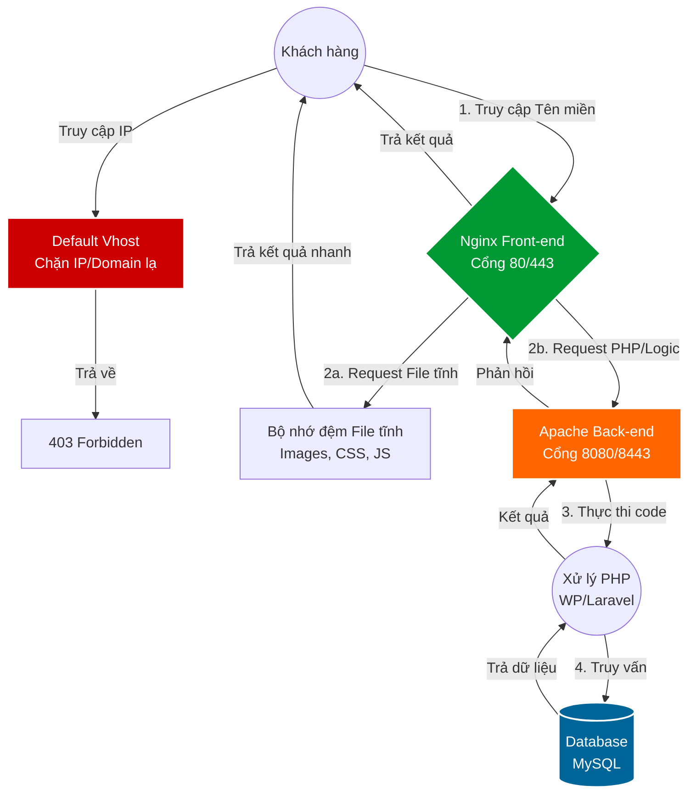

# BÁO CÁO KIẾN TRÚC HỆ THỐNG: TỐI ƯU HÓA REVERSE PROXY NGINX & APACHE

## 1. Tổng quan về sự chuyển đổi kiến trúc
Việc chuyển đổi từ mô hình LEMP cơ bản sang kiến trúc **Reverse Proxy** (Nginx đứng trước Apache) đánh dấu một bước tiến quan trọng trong việc tiếp cận các hệ thống chịu tải cao (High Availability). Đây là giải pháp tối ưu nhằm kết hợp tốc độ phản hồi file tĩnh của Nginx và khả năng xử lý logic linh hoạt của Apache.

---

## 2. Sơ đồ cơ chế hoạt động (System Architecture)

Dưới đây là sơ đồ luồng dữ liệu minh họa cách Nginx điều phối yêu cầu đến Apache và bảo vệ hệ thống:

### Giải thích sơ đồ cho người mới:
1.  **Giai đoạn tiếp nhận:** Nginx đóng vai trò "Lễ tân" tại cổng chuẩn 80/443. Mọi truy cập không đúng tên miền khai báo sẽ bị đẩy sang **Default Vhost** để chặn (403).
2.  **Phân loại yêu cầu:** * Nếu khách cần xem ảnh hoặc giao diện (File tĩnh), Nginx tự phục vụ ngay mà không cần làm phiền Apache.
    * Nếu khách cần đăng nhập hoặc tính năng (File động), Nginx đẩy sang cho Apache xử lý.
3.  **Hậu trường (Backend):** Apache nhận yêu cầu, kết nối Database và trả lại kết quả cho Nginx để trao tận tay khách hàng.

---

## 3. Mục đích thực hiện & Khái niệm cốt lõi

### 3.1 Mục đích tối thượng
Tạo ra một hệ thống vừa phản hồi siêu tốc, vừa xử lý logic phức tạp hoàn hảo, đồng thời tăng cường lớp bảo mật bằng cách ẩn Apache phía sau.

### 3.2 Các khái niệm quan trọng
* **Reverse Proxy:** Nginx đại diện cho các máy chủ bên trong để giao tiếp với Internet.
* **End-to-End Encryption:** Mã hóa xuyên suốt từ trình duyệt khách đến tận Apache thông qua cổng 8443, đảm bảo an toàn dữ liệu nội bộ.

---

## 4. Giải trình chuyên môn (Phản hồi yêu cầu của Leader)

### 4.1 Vì sao Nginx lại đứng trước Apache?
* **Chịu tải cao (High Concurrency):** Nginx xử lý file tĩnh nhanh gấp nhiều lần Apache với mức RAM cực thấp, giúp hệ thống không bị treo khi có lượng lớn người truy cập đồng thời.
* **Tối ưu tài nguyên:** Nginx "đỡ đạn" các yêu cầu đơn giản, dành toàn bộ tài nguyên CPU cho Apache tập trung xử lý các tác vụ PHP nặng.

### 4.2 Vai trò của Apache trong mô hình hiện tại
Trong cấu hình này, Apache đóng vai trò là **Application Server**. 
* Nhiệm vụ then chốt là thực thi code PHP và đọc file cấu hình `.htaccess`. 
* Vì WordPress và Laravel phụ thuộc rất nặng vào `.htaccess` để tối ưu đường dẫn (Rewrite URL), Apache đảm bảo các tính năng này chạy ổn định nhất mà không cần cấu hình phức tạp trên Nginx.

### 4.3 Tại sao cấu hình HTTPS ➡️ HTTPS và HTTP ➡️ HTTP?
Cấu hình này tuân thủ yêu cầu khắt khe về **Mã hóa đầu cuối**:
* **Bảo mật nội bộ:** Dữ liệu được bảo vệ ngay cả khi di chuyển giữa các dịch vụ trong máy chủ.
* **Nhận diện giao thức:** Giúp Framework (Laravel/WP) nhận diện chính xác giao thức khách đang dùng, tránh lỗi vòng lặp chuyển hướng (Redirect Loop).

